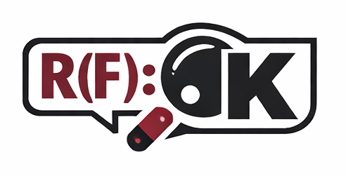
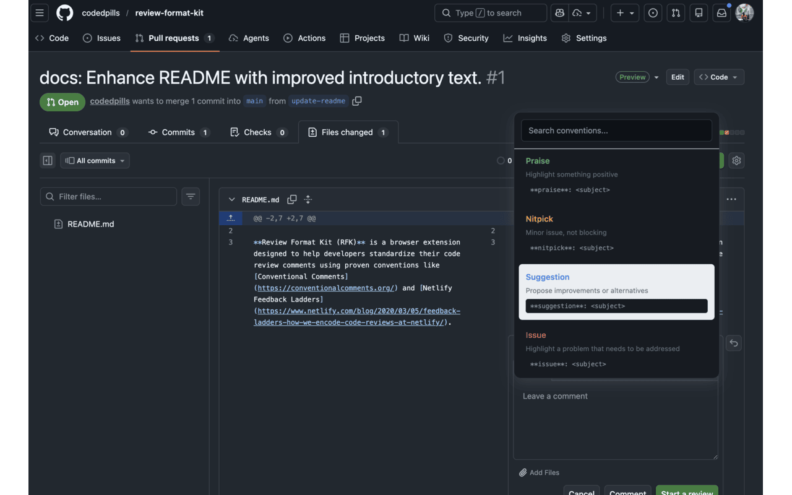
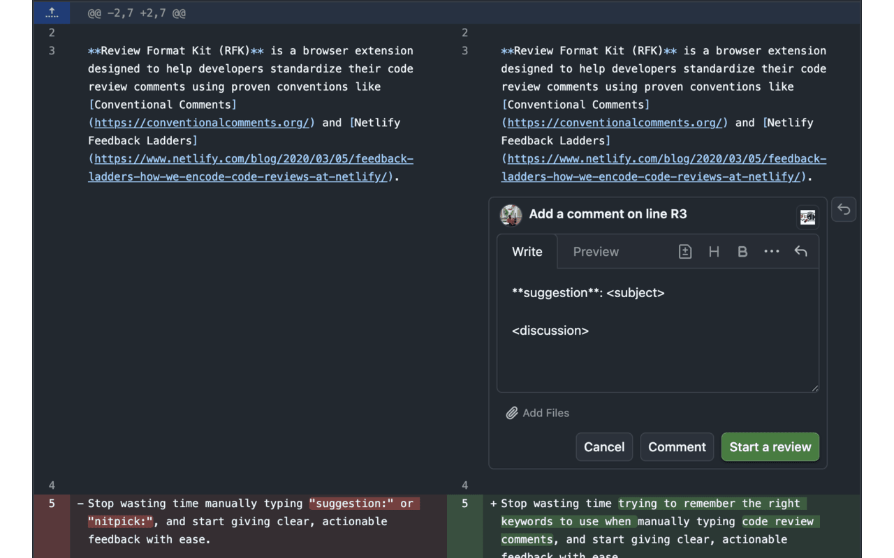
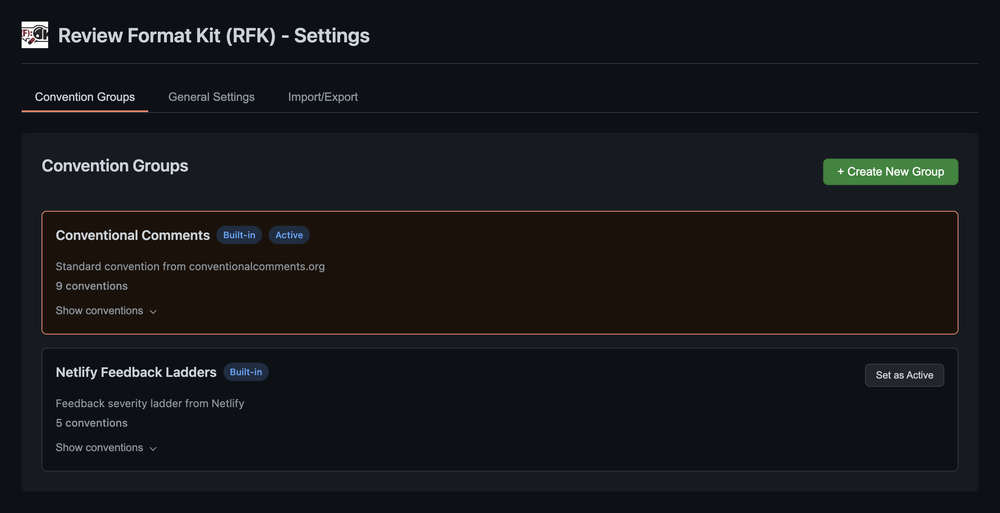
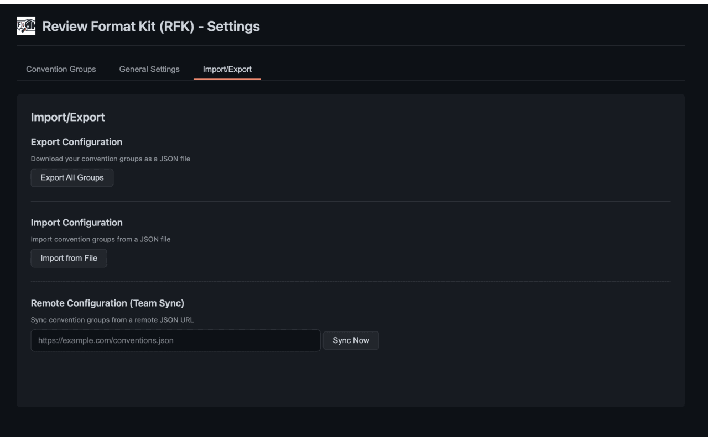

#  Review Format Kit (RFK)

**Review Format Kit (RFK)** is a browser extension designed to help developers standardize their code review comments using proven conventions like [Conventional Comments](https://conventionalcomments.org/) and [Netlify Feedback Ladders](https://www.netlify.com/blog/2020/03/05/feedback-ladders-how-we-encode-code-reviews-at-netlify/).

Stop wasting time trying to remember the right keywords to use when manually typing code review comments, and start giving clear, actionable feedback with ease.

## Key Features

- 📝 **Pre-configured Conventions**: Ships with standard sets like Conventional Comments and Feedback Ladders.
- 🎯 **Custom Groups**: Build your own convention sets for your team or personal preference.
- 🔄 **Team Sync**: Keep your entire team aligned by syncing configurations via a JSON URL.
- ⌨️ **Keyboard Shortcuts**: Open the UI instantly with `Cmd+Shift+/` (Mac) or `Ctrl+Shift+/` (Windows/Linux).
- 🎨 **Visual Previews**: See what you're inserting before it hits the textarea.
- 🌑 **Dark Mode**: Fully supports GitHub's light and dark themes.

---

## How to Use

Once installed, RFK integrates directly into your GitHub workflow:

1. **Go to any Pull Request** on GitHub.
2. **Click inside a comment field** (new comment, review, or inline reply).
3. **Trigger the UI**: Click the floating convention icon in the toolbar or use the keyboard shortcut (`Cmd+Shift+/`).
   
4. **Select your convention**: Search or navigate through your active group and press Enter.
5. **Add details**: Fill in the placeholders in the inserted template.
   

## Configuration & Customization

### Manage Your Groups
Access the extension settings to manage your conventions:
1. Click the RFK extension icon in your browser toolbar.
2. Click **Open Settings**.
3. In the **Convention Groups** tab, you can create new groups, edit existing ones, or view what's inside a group using the **Show conventions** accordion.

### Team Synchronization
Aligned teams review faster. To share conventions:
- **Export**: Download your group configuration as a JSON file from the Import/Export tab.
- **Sync**: Enter a URL to a shared JSON configuration in the settings to automatically keep your team's conventions up to date.

---

## Technical Details (For Developers)

### Installation from Source
If you are building RFK manually:
1. Clone the repository: `git clone https://github.com/yourusername/review-format-kit.git`
2. Install dependencies: `npm install`
3. Build the extension: `npm run build`
4. Load the `dist/` folder as an unpacked extension in `chrome://extensions/`.

### Available Scripts
- `npm run dev`: Build with hot-reloading.
- `npm run build`: Production build with output validation.
- `npm test`: Run full test suite with Vitest.
- `npm run test:coverage`: Generate coverage reports.
- `npm run format`: Prettify source code.

### Extension Structure
- `src/content`: GitHub-specific injection logic and UI.
- `src/background`: Service worker for sync and lifecycle.
- `src/options` & `src/popup`: Extension management interfaces.
- `src/lib`: Core configuration and storage logic.

---

## Roadmap & Support

- [x] v1.0: Core GitHub Integration & Remote Sync
- [ ] v1.1: Multi-browser Store Release (Chrome, Firefox, Edge)
- [ ] v2.0: GitLab & Bitbucket Support
- [ ] v2.0: Workspace-specific auto-detection

- 🐛 [Report a Bug](https://github.com/yourusername/review-format-kit/issues)
- 💡 [Request a Feature](https://github.com/yourusername/review-format-kit/issues)

## License
MIT License - see [LICENSE](LICENSE) for details.
